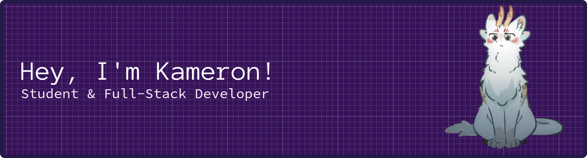

  

###

  
  

###

  

###

<h3 data-importer="text" align="left">😺 About Me</h3>

###

I'm from a small river town in Ohio called Gallipolis  - 🔭 I’m currently working as Student Life Engagement Support @ Berea - 📚 I'm currently learning Rust. - ⚡ In my free time I like to play video games, make music and draw!

###

<h3 data-importer="text" align="left">🛠 Language and tools</h3>

###

  
  
  
  
  
  
  
  
  
  
  
  
  
  
  
  
  
  
  
  
  
  
  
  
  

###

<picture data-importer="pacman">
  <source media="(prefers-color-scheme: dark)" srcset="https://raw.githubusercontent.com/barnesfoss/barnesfoss/pacman-output/pacman-contribution-graph-dark.svg?game=pacman">
  <source media="(prefers-color-scheme: light)" srcset="https://raw.githubusercontent.com/barnesfoss/barnesfoss/pacman-output/pacman-contribution-graph.svg?game=pacman">
  
</picture>

###
