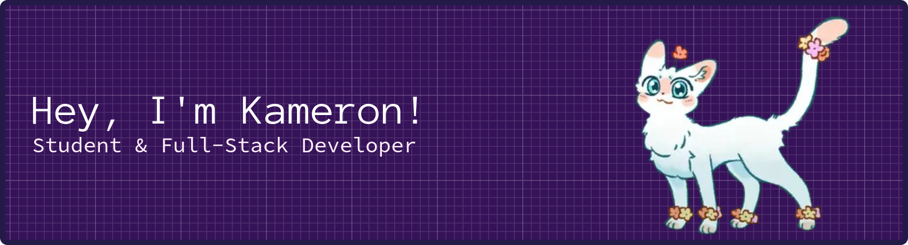

  
   
  <i text-align="center">any pronouns | EN/ZH</i>

###

  
  

---

### 😺 About Me

&emsp;🌎 - I'm from a small river town in Ohio called Gallipolis 
&emsp;🔭 - I’m currently working as Registered Student Organization Support @ Berea  
&emsp;📚 - I'm currently learning Rust  
&emsp;⚡ - In my free time I like to play video games, make music and draw!  
### ✍️ Languages
  

  

### 🛠 Tools
  

  
